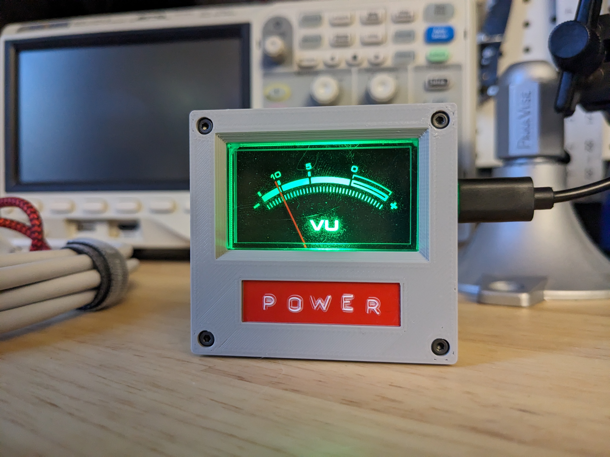
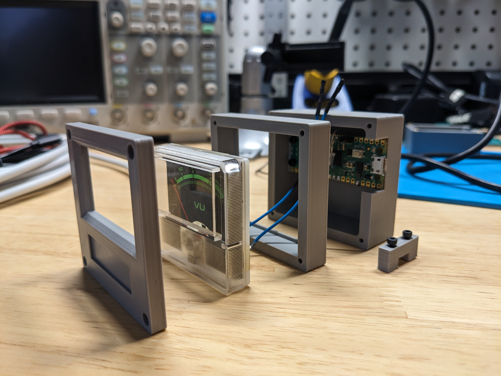

# NuVu Meter

An IoT VU meter for...whatever you want.

## In this Repo
- Arduino code for the Pi Pico is in the `/code` folder
- FreeCAD project file, STLs, and gcode for an Ender 3 are in the `/enclosure` folder
- KiCad schematic is in the `/schematic` folder

## BOM

- 1 x VU Meter (mine was salvaged so this is going to be tough to find in the right size)
- 1 x Pi Pico W
- 1 x 5mm RGB LED
- 4 x M2*22mm (socket head)
- 2 x M2*12mm (socket head)
- 2 x M2*8mm (socket head)
- 3d printed faceplate
- 3d printed VU meter retainer
- 3d printed back cover
- 3d printed filler block
- misc wires

## License

Code, schematics, and models (excluding the two listed below) are licensed under GPL v3 (see license file for details).

## Attributions

- Raspberry Pi Pico-R3 model is from https://thangs.com/designer/Evil%20Genius%20Laboratory/3d-model/Raspberry%20Pi%20Pico-12567
- LED 5mm   T5 1/4 is by FrankWL on Thingiverse: https://www.thingiverse.com/thing:3980832